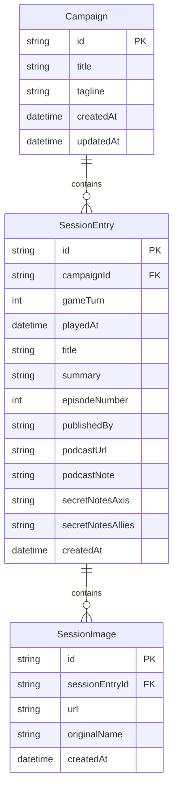

# CFNA play log

A small web app for **[War With A Mate](https://warwithamate.co.uk/)**–style play logging of SPI’s *Campaign for North Africa* (CNA): public timeline of sessions, per–game-turn progress, and a password-protected publisher area. Rules reference: [TheCampaignForNorthAfrica](https://github.com/tonicebrian/TheCampaignForNorthAfrica) on GitHub.

## Stack

- **Next.js 15** (App Router), React 19, TypeScript, Tailwind CSS  
- **Prisma** + **SQLite** (`prisma/dev.db`)  
- **Publisher auth**: `jose` (HS256 JWT in an httpOnly cookie)  
- **Uploads**: JPEG images under `public/uploads/`

## What’s built

### Public site (`/`)

- **Layout**: main column is capped at about **1280px** on large viewports (`max-w-7xl`), with extra padding from **`lg`**. Publisher pages use **`max-w-6xl`** so forms stay readable but wider than a phone column.  
- **Campaign header** with War With A Mate branding (logo from their site) and links to the podcast site and Apple Podcasts.  
- **Turn navigator (sidebar)**  
  - **Game-turns** are listed **newest first** (highest turn number at the top).  
  - Each game-turn is a **`
` block**, **collapsed by default**.  
  - Expanding a turn lists **every session** (date, **publisher username** when recorded, + title), **newest played date first**, with links to **`/?turn=N#session-{id}`** so the main column scrolls to that entry.  
  - **Turn N** in the summary row is a link to `?turn=N` without a hash (top of that turn’s list).  
  - Summary row shows progress bar, session count, and **Done** when the **full 15-step turn flow** is complete; the active turn (main column) is labeled **Shown →**.  
- **Turn progress graphic**  
  - Reflects the **selected** turn (from `?turn=`, defaulting to the latest turn with data).  
  - **One combined flow**: initiative and naval, strategic and convoy air, stores and water/attrition, then for each **Ops Stage** in order **air → supply → land** — **15 checkpoints** merged across sessions (OR logic).  
- **Session list for the selected turn**  
  - The main column shows **only the selected** turn’s sessions (`?turn=N`), **newest first** by played date. Session blocks have **`id="session-{id}"`** for hash navigation from the sidebar.  
  - Each card shows **session date** and **by** the **publisher username** (who first created the entry), title, summary, episode note, optional podcast link, optional images, and milestone dots for what that sitting completed.  
- **Strategist notes** (optional per entry), **split by side**  
  - **`secretNotesAxis`** and **`secretNotesAllies`** are entered separately on publish; on the public log each side has its own **Reveal** / **Hide** control.  
  - Axis and Allies blocks use distinct styling; neither is shown until that side’s button is used.  
  - This is **not** encryption: determined readers can still inspect network or client data.

### Publisher flow (`/publish/login`, `/publish`, `/publish/new`, `/publish/edit/[id]`)

- **Username / password** (from environment variables). Successful sign-in sets an **httpOnly** cookie holding a signed **JWT**; cookie **max-age** and token expiry are **14 days** (see `src/lib/auth.ts`). The **username** is stored on each new session row as **`publishedBy`** (creator only; not overwritten on edit) and shown on the public log next to the session date.  
- **`/publish`** — dashboard: **Publish a new session log** links to **`/publish/new`**; below that, the **Published sessions** list (**newest `playedAt` first**) with date and creator username when present. **Edit** opens the full form; **Delete** asks for confirmation, then removes the row and **deletes image files** under `public/uploads/` for that session.  
- **`/publish/new`** — **New session entry** form:  
  - Game-turn number, session date (defaults to **now** in the browser’s local timezone).  
  - Title and summary (public-facing narrative).  
  - **Episode #** as integer **`episodeNumber`** (pre-filled as **max existing episode + 1**); optional **episode detail** suffix is composed into **`podcastNote`** as `Ep N` or `Ep N — …`.  
  - Optional podcast URL.  
  - Optional **Axis** and **Allies** strategist note fields behind **Reveal** / **Hide** (same privacy idea as the public site).  
  - **Interactive turn flow** graphic (15 steps, same as the public site) for milestones.  
  - Multiple **JPEG** uploads per entry; on **edit**, you can remove existing images or add more.  
- **`/publish/edit/[id]`** — same form for an existing entry.  
- **Sign out** clears the publisher cookie.

### Data model (high level)

- **Campaign** (one is seeded; the UI assumes a primary campaign).  
- **SessionEntry**: **`gameTurn`**, `playedAt`, **`publishedBy`** (optional string — publisher username set on **create** only), title, summary, **`episodeNumber`** (int, for sort / RSS), composed **`podcastNote`** string, optional `podcastUrl`, optional **`secretNotesAxis`** / **`secretNotesAllies`**, land / air / logistics milestone booleans (aggregated into the single **15-step** public flow). Older rows may have `publishedBy` null until backfilled or re-seeded.  
- **SessionImage**: file path under `/uploads/…`.

### ERD

Relationships use **onDelete: Cascade** in Prisma (deleting a campaign removes its sessions; deleting a session removes its images). **`SessionEntry`** also has **`createdAt`** plus **fifteen `done*` booleans** (initiative, naval, air, logistics, ops stages) omitted from the diagram for space — see [`prisma/schema.prisma`](prisma/schema.prisma).

### Scripts

| Command        | Purpose                          |
|----------------|----------------------------------|
| `npm run dev`  | Dev server (Turbopack)           |
| `npm run build` / `npm start` | Production build & run |
| `npm run db:push` | Apply `schema.prisma` to SQLite |
| `npm run db:seed` | Reset seed data (deletes sessions/campaign and reinserts) |
| `npm run lint` | ESLint                           |

`npm install` runs **`prisma generate`** automatically (`postinstall` in `package.json`).

## Setup

1. **Install**  
   `npm install`

2. **Environment**  
   Copy `env.example` to `.env` and set:
   - `DATABASE_URL` — e.g. `file:./dev.db` (path is **relative to the `prisma/` directory**, so this creates `prisma/dev.db`)  
   - `AUTH_USERNAME`, `AUTH_PASSWORD`, `AUTH_SECRET` (minimum **16** characters for `AUTH_SECRET`; enforced in `src/lib/auth.ts`)

3. **Database**  
   `npm run db:push`  
   Optional sample data: `npm run db:seed` (destructive: clears campaign and entries).  
   After **`db:push`**, new columns use Prisma **`@default`** values until you backfill; if ordering or episode numbers look wrong on an old file, re-seed or fix rows in Prisma Studio.

4. **Run**  
   `npm run dev` → open [http://localhost:3000](http://localhost:3000)

## Design choices (CNA vs table)

- In the **rulebook**, one **game-turn** is one **simulated campaign week**.  
- At your table, a turn may take **much longer in real time** (e.g. ~a month); copy in the app and seed text reflects that distinction.

## What could be built next

Ideas that fit the same project without changing the core “play log” idea:

- **Stronger secrecy** for strategist notes: load content only after reveal via a separate API route (still not true end-to-end encryption unless you add keys).  
- **Multiple campaigns** or scenarios (schema already has `Campaign`; UI would need a selector).  
- **Map snapshot** links or embedded images per session.  
- **Search** across titles, summaries, and turns.  
- **Export** (JSON/Markdown) for backup or archival episodes.  
- **Deployment**: SQLite on a single instance is simple; for serverless or multi-instance hosts, move to Postgres and object storage for uploads.  
- **No rules engine**: the app does not validate CNA rules or CP spend; that remains intentionally out of scope unless you want a multi-year second project.

## Layout breakpoints (Tailwind)

Useful when checking the **turn progress graphic** (four phase columns on wide screens, one column on narrow):

| Prefix | Min width | Typical use here |
|--------|-----------|------------------|
| (none) | 0 | Mobile-first base styles |
| `sm:` | 640px | Slightly larger phones / small tablets |
| `md:` | 768px | Tablets |
| **`lg:`** | **1024px** | **Four phase columns** for the turn graphic; main `max-w-7xl` padding |
| `xl:` | 1280px | Wide desktop |

**How to preview:** In **Firefox** or **Edge**, open **Developer Tools** (F12) → **Responsive Design Mode** (Ctrl+Shift+M / Cmd+Shift+M) and drag the width past **1024px** to see the `lg` layout. The turn graphic’s phase grid uses the same **1024px** breakpoint in `TurnProgressGraphic.module.css`.

## License / attribution

Podcast name and artwork belong to **War With A Mate**. CNA rules transcription is credited to the [TheCampaignForNorthAfrica](https://github.com/tonicebrian/TheCampaignForNorthAfrica) project; the board game is SPI’s *Campaign for North Africa* (1978).

This repository’s application code is provided as-is for the maintainers’ use; add a license file if you open-source it.
