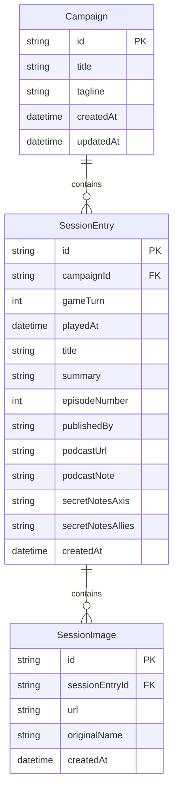

# Campaign for North Africa — Living Play Log

---

## Part I — The Play Log

### What is this?

Two mates. One of the most brutally complex board games ever printed. A microphone. And now, a website.

**[War With A Mate](https://warwithamate.co.uk/)** is a podcast where James and Matt are playing SPI's legendary *Campaign for North Africa* (1978) — a wargame so notoriously detailed it famously requires a dedicated player just to track Italian pasta rations. A full campaign is estimated at **1,500+ hours of play time**. They're doing it anyway.

This site is the **living record of that campaign**: every session logged, every game-turn tracked, every strategic decision filed for posterity. It's part play diary, part historical dispatch board, and part monument to magnificent stubbornness.

---

### What you can do here:

#### 📡 Read the dispatches

> Every session lands on the site as a **field dispatch** — stamped with a date, credited to whoever filed it, and indexed by game-turn. Each entry carries a title, a narrative summary of what happened at the table, and milestone markers showing exactly which of the 15 turn-flow checkpoints that sitting completed. Photos of the actual board can be attached. It reads like a war correspondent's filing cabinet.
>
> Both the Axis and Allied strategists may leave **sealed notes** on any dispatch — observations, plans, and post-game analysis that are hidden behind a Reveal button by default. You choose when (and whether) to read them. Fair warning: they may contain intelligence that spoils the suspense.

---

#### 🗺 Track every inch of the campaign

> A **turn navigator** runs down the side of the page — every game-turn played, newest at the top, oldest buried below. Expand any turn to see every session inside it, click straight to a specific dispatch, and watch the **progress bar** fill as the team grinds through the 15-step turn flow. Completed turns earn a **Done** badge. The turn currently on display is marked **Shown →** so you can never lose your place.

---

#### ⚔️ See the War Situation, turn by turn

> The **War Situation** graphic shows the full merged turn-flow for whichever turn you're reading — all 15 checkpoints from initiative and naval through strategic air, convoy air, stores expenditure, water and attrition, and every ops-stage air, supply, and land action, in order. Completed steps are marked in red. Below it, each session card shows **milestone dots** for exactly what that one sitting checked off — so you can see the campaign being built, sitting by sitting, week by week.

---

#### 🔍 Drill into individual episodes

> Every dispatch has its own dedicated page with a full turn-progress graphic that highlights only what *that session* completed — useful for following along with a specific episode of the podcast. A sticky nav bar keeps the route back to the main log always in reach.

---

#### 🎙 Read along with the podcast

> Every dispatch that has a matching episode links directly to it on the War With A Mate site and Apple Podcasts. The log and the audio are designed to be experienced together — read the dispatch, then listen to the episode, or listen first and come back to check the milestones. Either way works.

---

### Why does it look like a 1940s newspaper?

Because the game is set in the Western Desert campaign of 1940–43, and a wartime dispatch board felt right. The UI uses aged newsprint paper, ink typography, ornamental dividers, and a typewriter monospace font — the kind of aesthetic you'd expect from a signals officer's field report. Every design choice is in service of the setting.

---

### Live site

Currently hosted on Railway: **[cfna-production.up.railway.app](https://cfna-production.up.railway.app)**

---
---

## Part II — Technical Reference

### Stack

- **Next.js 15** (App Router), React 19, TypeScript, Tailwind CSS  
- **Prisma** + **SQLite** (`prisma/dev.db`)  
- **Publisher auth**: `jose` (HS256 JWT in an httpOnly cookie)  
- **Uploads**: JPEG images stored under `public/uploads/`

---

### Visual design system — 1940s newsprint

| Element | Detail |
|---------|--------|
| Background | `NewsprintBackdrop` — `#f5f0e1` cream with grain texture and aged-edge vignette |
| Colour tokens | `np-paper`, `np-ink`, `np-ink-light`, `np-ink-muted`, `np-rule`, `np-aged`, `np-red` |
| Display font | [Playfair Display](https://fonts.google.com/specimen/Playfair+Display) |
| Body font | [Lora](https://fonts.google.com/specimen/Lora) |
| Mono / labels | [Special Elite](https://fonts.google.com/specimen/Special+Elite) — typewriter face |
| Section dividers | `OrnamentalRule` component (`✽` between two rules) |
| Session cards | `border-t-2` rule style; images with `shadow-print` |
| Tailwind additions | `border-3`, `shadow-print`, `border-double` with `border-b-3` |
| Main column width | `max-w-5xl` (narrowed from previous `max-w-7xl`) |

The previous dark "desert void" theme (`wwam-*` tokens, `DesertBackdrop`, Fraunces / Source Sans / Geist Mono fonts, compass mark, pill-button nav) has been fully replaced.

---

### Publisher flow

`/publish/login` → `/publish` → `/publish/new` / `/publish/edit/[id]`

- **Auth**: username + password from env vars. Sets an httpOnly cookie with a signed JWT; 14-day expiry (`src/lib/auth.ts`).
- **`publishedBy`**: set on create, never overwritten on edit; shown on public-facing cards.
- **New/edit form**: game-turn, session date (defaults to local now), title, summary, episode number (auto-increments), episode detail suffix, podcast URL, Axis/Allies strategist notes (behind Reveal/Hide), 15-step turn-flow milestone picker, JPEG uploads.
- **Dashboard**: lists all sessions newest-first; Edit and Delete (with confirmation + image file cleanup) per entry.

---

### Data model



`SessionEntry` also carries **fifteen `done*` booleans** (initiative, naval, air, logistics, ops stages) that feed the turn-progress graphic. All relationships use `onDelete: Cascade`.

---

### Scripts

| Command | Purpose |
|---------|---------|
| `npm run dev` | Dev server (Turbopack) |
| `npm run build` / `npm start` | Production build & run |
| `npm run db:push` | Apply `schema.prisma` to SQLite |
| `npm run db:seed` | Reset seed data (destructive) |
| `npm run lint` | ESLint |

`npm install` runs `prisma generate` automatically via `postinstall`.

---

### Setup

1. `npm install`
2. Copy `env.example` → `.env` and set `DATABASE_URL`, `AUTH_USERNAME`, `AUTH_PASSWORD`, `AUTH_SECRET` (min 16 chars).
3. `npm run db:push` — optional sample data: `npm run db:seed` (clears everything).
4. `npm run dev` → [http://localhost:3000](http://localhost:3000)

---

### Railway deployment (temporary)

```toml
# railway.toml
[build]
buildCommand = "npm ci && npm run build"

[deploy]
startCommand = "npx prisma db push && npx prisma db seed && npm start"
healthcheckPath = "/"
restartPolicyType = "on_failure"
```

- Set `AUTH_USERNAME`, `AUTH_PASSWORD`, and `AUTH_SECRET` as Railway environment variables.
- SQLite and uploads live on the Railway instance. If the instance is replaced, both are lost — migrate to Postgres + object storage (e.g. R2/S3) for durability.
- `DATABASE_URL` should point to a persistent volume path (e.g. `file:/data/dev.db`) if you want data to survive redeploys.

---

### Layout breakpoints

| Prefix | Min width | Use |
|--------|-----------|-----|
| (none) | 0 | Mobile base |
| `sm:` | 640px | Small tablets |
| `md:` | 768px | Tablets |
| **`lg:`** | **1024px** | Four-column turn graphic; `max-w-5xl` padding kicks in |
| `xl:` | 1280px | Wide desktop |

---

### What could be built next

- **Stronger strategist note secrecy** — serve content via a separate API route after reveal (still not true E2E encryption without client-side keys).
- **Multiple campaigns / scenarios** — schema already has `Campaign`; UI needs a selector.
- **Map snapshot links** or embedded images per session.
- **Full-text search** across titles, summaries, and turns.
- **Export** (JSON/Markdown) for backup or archival.
- **Persistent Railway storage** — Postgres + R2/S3 to survive redeploys and scale past a single instance.
- **No rules engine** — CP spend and rule validation are intentionally out of scope.

---

### License / attribution

Podcast name and artwork belong to **War With A Mate**. CNA rules transcription is credited to the [TheCampaignForNorthAfrica](https://github.com/tonicebrian/TheCampaignForNorthAfrica) project; the board game is SPI's *Campaign for North Africa* (1978).

Application code is provided as-is for the maintainers' use; add a license file if you open-source it.

---
---

## AI Disclosure

This project was built with heavy AI assistance throughout. In the interest of transparency:

| Tool | Role |
|------|------|
| **[Cursor](https://www.cursor.com) v1.115.0** | Primary IDE — all code written and edited here |
| **Claude Sonnet 4.5 / Sonnet 4** | Agent model for code generation, refactoring, and feature implementation (via Cursor Agent) |
| **Claude Sonnet 3.7** | Earlier sessions during initial build |
| **Next.js, Prisma, Tailwind** | Frameworks chosen in part based on AI recommendations for rapid solo development |

The entire application — from initial scaffold through the 1940s newsprint redesign, Railway configuration, and this README — was written in Cursor with AI agents doing the majority of the implementation work. The humans specified what to build and what it should look like; the AI wrote most of the code.

This is noted not as a disclaimer but as an honest account of how modern hobby projects get built in 2025–26.
